#  Gestion des Patients Spring MVC Thylemeaf Spring Data JPA
### `1- Entities`
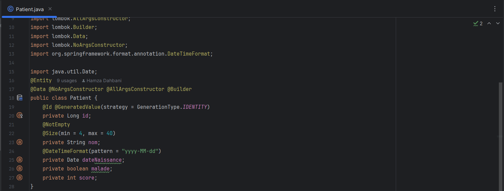

### `2- Repositories`
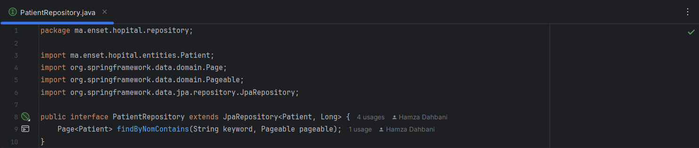

### `3- Couche web`
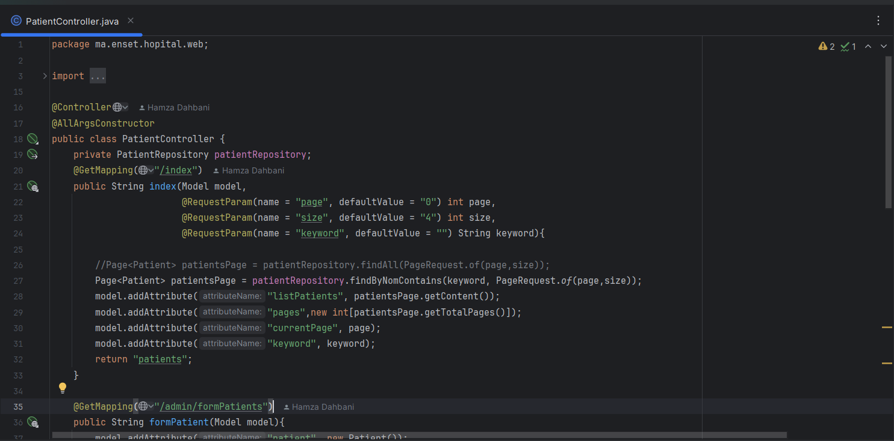

### `4- Page template`
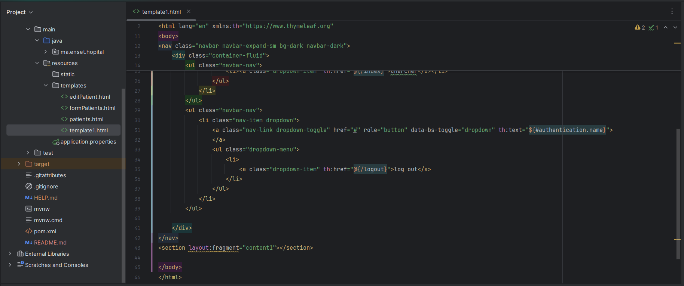

### Liste des Patients
`Affichage des patients`

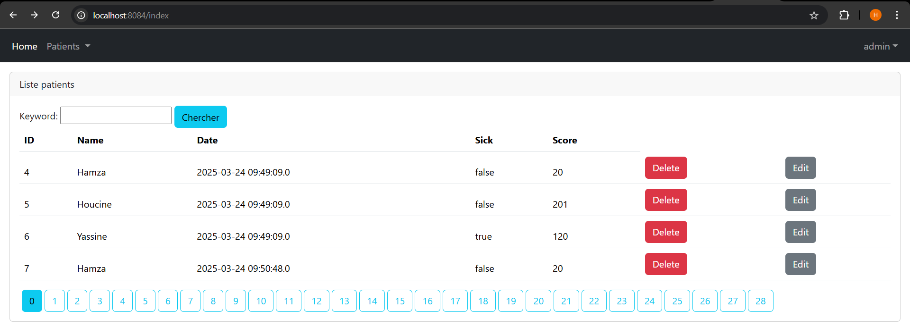

`La pagination`

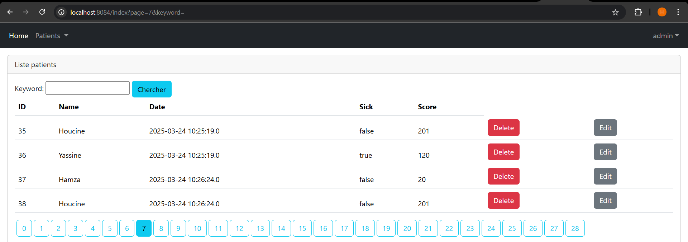

`Recherche des patients`

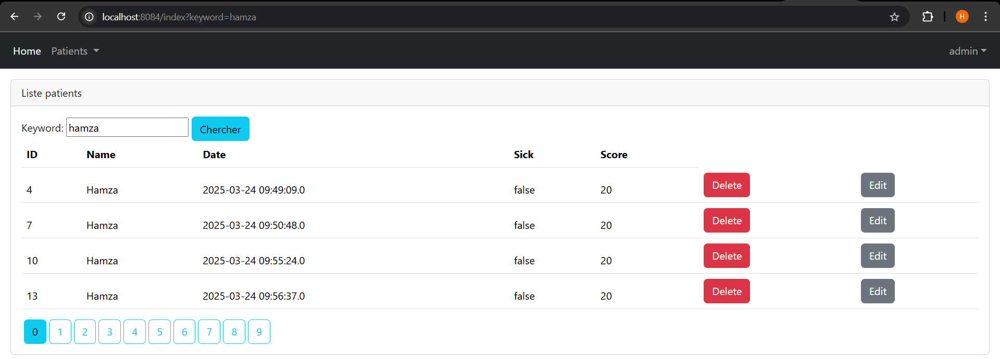

`Supprimer un patient`

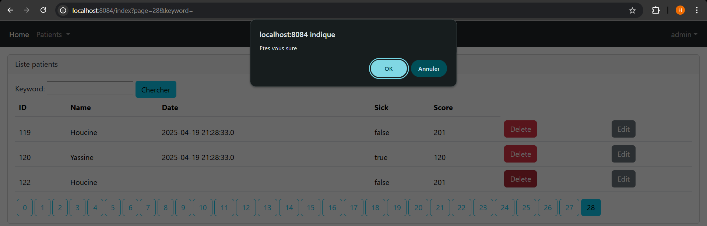
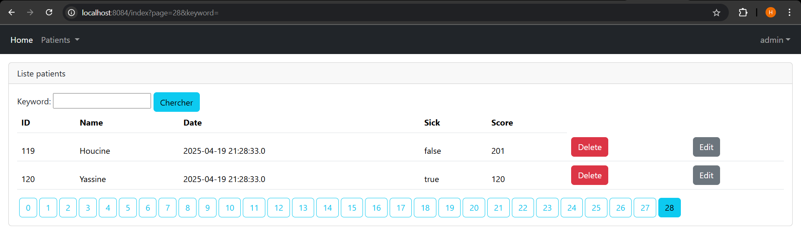

### Validation des formulaires

`Ajouter un nouveau patient`

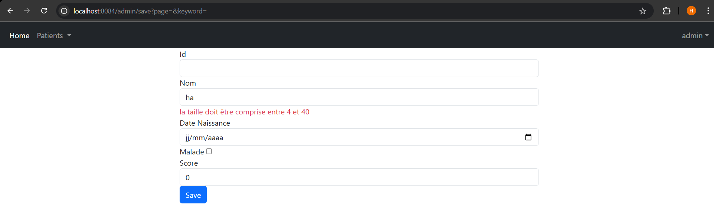

`Modifier les infos d'un patient`

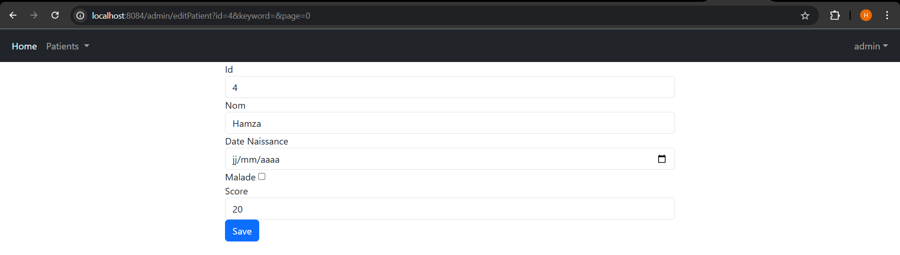

### Sécurité avec Spring security
### ` InMemomy Authentication`

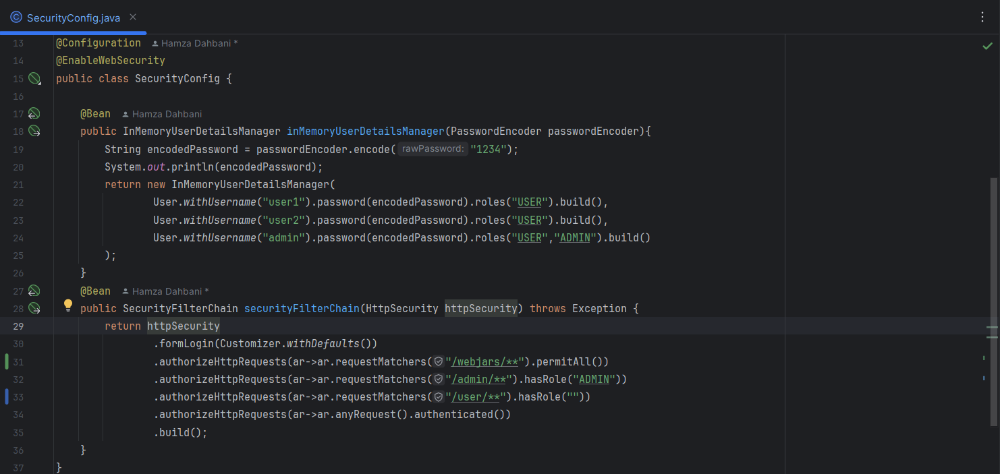
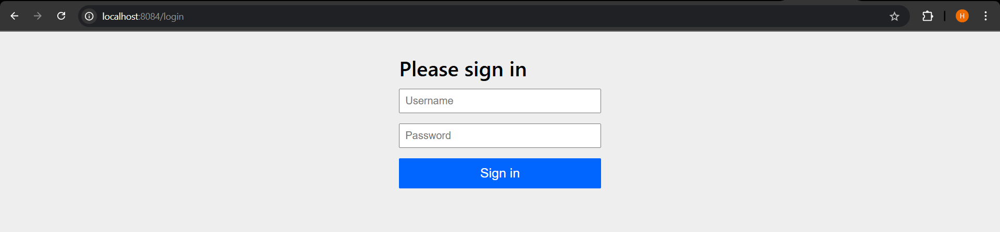

